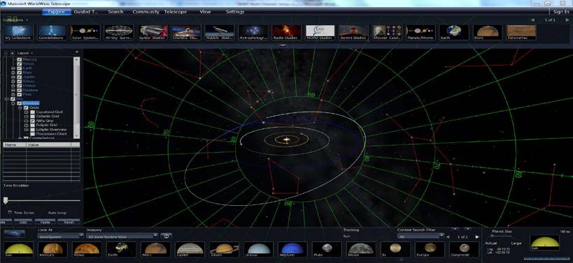

+++
title = "Confirm Alignment"
weight = 700
+++

1. Confirm alignment
  1. Close Multi Channel Setup Window
  2. Open `Layers>Sky>Overlays>Grids` and turn on Alt-Az Grid to confirm
     grid alignment. This will bring up a grid on all the nodes.
  3. Turn off grid when done
  4. Open a Scene Such as “Look at Earth” or “Solar System”
  5. Fly in and out and confirm alignment

