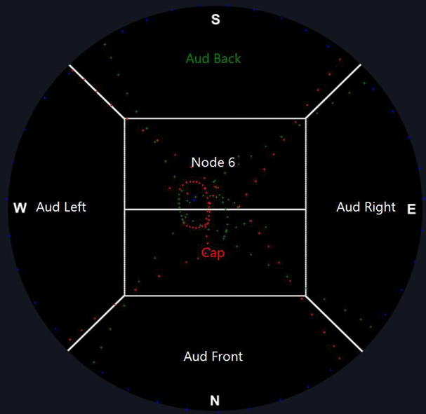
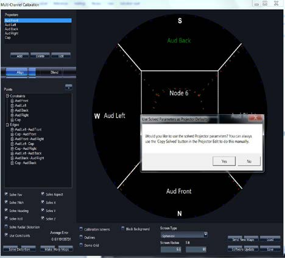
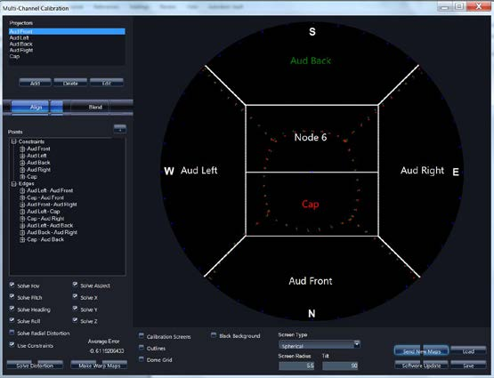

# Solve Alignment/Distortion

1.  Use WWT to solve the alignment
  -  Click Solve Distortion.
  -  WWT will use algorithms to solve alignment showing its average error and keep cycling until there is no better solution.
  -  3.0 or better for an average error is preferred

  _An example of what a map looks like after distortion has been solved with incorrect edge points_
  

  _An example of what a map should look like after distortion has been solved and correct constraint and edge points_
  

1.  If you are happy with the distortion solved, click yes to send solved projector parameters to each node

1.  Save. Save different versions often.

